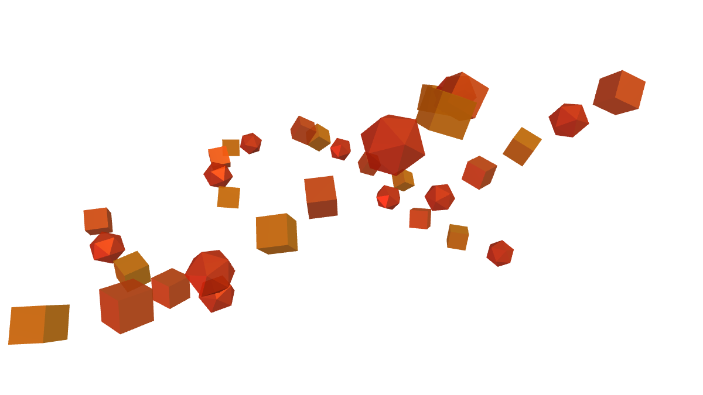

# hyperframes-render-discipline

**A Systo skill.** Six verification habits for render and capture work. Every one of
them exists because a bug shipped, or nearly shipped, without it.

Five came from building the same five-beat stat video twice in one session, once in
HyperFrames and once in Remotion. Neither framework is better. But Remotion's tooling
made certain checks unavoidable that HyperFrames leaves optional, and each of those
checks maps to a real defect. The sixth was harvested from a puppeteer QA harness and
is about capturing frames without lying to yourself.

---

## The habit with the best story: assert on pixels, never on file size

Lesson 6 says capture frames through a sink to disk and assert the frame is not blank.
The obvious way to assert that is file size. **File size does not work**, and this repo
contains the run that proves it.

Same WebGL canvas, same page, captured twice at 1200x675.

| | Wrong way | Right way |
|---|---|---|
| |  |  |
| Method | Read `toDataURL()` with no forced render | Force one render, then read, same block |
| File size | **18.1 KB** | 64.4 KB |
| Size verdict | "has content" | "has content" |
| Distinct colours | **1** | **161** |
| Pixel verdict | **BLANK** | has content |

The left image is completely empty. It still weighs 18.1 KB, so any rule of the shape
"under 15 KB means blank" passes it as real content and the capture ships silently.

The reliable test counts distinct pixel values on a downsampled copy:

```js
const s = document.createElement('canvas'); s.width = 64; s.height = 36;
const x = s.getContext('2d'); x.drawImage(canvas, 0, 0, 64, 36);
const d = x.getImageData(0, 0, 64, 36).data, seen = new Set();
for (let i = 0; i < d.length; i += 4) seen.add(`${d[i]},${d[i+1]},${d[i+2]},${d[i+3]}`);
// seen.size === 1 means every sampled pixel is identical, so nothing rendered
```

There is a second trap stacked on top of the first. **The pixel count and the
`toDataURL` must run in the same synchronous block as the draw.** Without
`preserveDrawingBuffer` the buffer clears after each composite, so a pixel test in a
second `page.evaluate()` reads an already-cleared canvas and reports *every* capture as
blank, including the good one. That mistake looks exactly like a real bug. It cost a
round here before the numbers made it obvious.

Both images above were produced by a script driving the demo page from the companion
[`threejs-scroll-sites`](https://github.com/systoai-design/threejs-scroll-sites) repo, whose render governor stops drawing when nothing moves.
That is precisely the condition where a naive screenshot returns nothing.

---

## The other five

| # | Habit | The bug it catches |
|---|---|---|
| 1 | Verify rendered duration with `ffprobe`, not the CLI summary | A render overshot into ~2s of blank frames because `TransitionSeries` subtracts transition time rather than adding it |
| 2 | One source of truth for duration, never a hand-synced pair | A guessed composition duration living apart from the computed sequence total. Two numbers that could drift, and did |
| 3 | Pair every GSAP exit tween with its hard kill on creation | `gsap_exit_missing_hard_kill` fired on two separate projects in one session, because the fix was applied per tween instead of built into the helper |
| 4 | Re-verify contrast against the composited background | One accent colour broke contrast twice in a single project, once behind a glow bloom and once under a 5% alpha wash, because each fix was checked against a flat background |
| 5 | When a bug survives two blind fixes, dump ground truth | Three guessed fixes to a Blender alignment bug all failed. A five-line script printing real world-space bounding boxes found it immediately |
| 6 | Capture through a sink, assert on pixels | Above |

The skill also states plainly where the Remotion contrast does **not** transfer, so the
comparison does not turn into an argument for adopting React.

---

## Install

```bash
git clone https://github.com/systoai-design/hyperframes-render-discipline.git ~/.claude/skills/hyperframes-render-discipline
```

On Windows, keep the repo off `C:` and expose it with a junction:

```powershell
git clone https://github.com/systoai-design/hyperframes-render-discipline.git "E:\New Claude\skills\hyperframes-render-discipline"
New-Item -ItemType Junction -Path "$env:USERPROFILE\.claude\skills\hyperframes-render-discipline" -Target "E:\New Claude\skills\hyperframes-render-discipline"
```

## When it fires

Before finalising render timing, after any render, whenever a GSAP exit tween is added,
whenever a background element changes near existing text, whenever a visual bug survives
two blind fixes, and whenever you screenshot a canvas or WebGL scene.

## Related Systo skills

- [**threejs-scroll-sites**](https://github.com/systoai-design/threejs-scroll-sites) for the render governor that creates the not-drawing condition
- [**manifesto**](https://github.com/systoai-design/manifesto) for frame-accurate video replication, which lives or dies on honest captures
- [**motion-graphics-director**](https://github.com/systoai-design/motion-graphics-director) runs the process gates before this skill's technical ones

## House style

Plain English, confident, warm. No em dashes.

Measured on Windows 11, Chromium via Playwright, Python 3.12.
