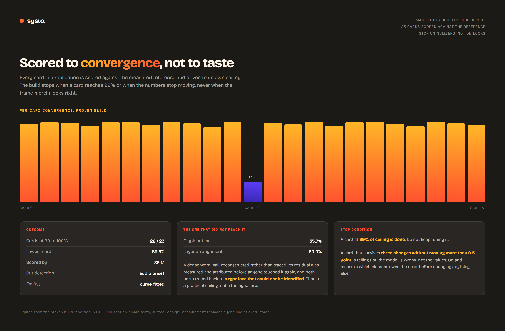
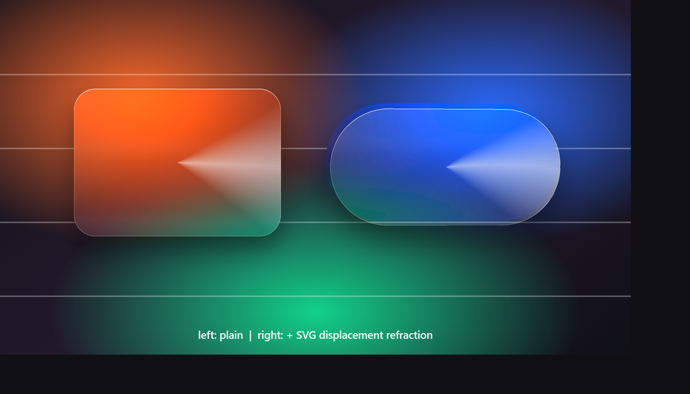

# manifesto

**A Systo skill.** Replicate a motion-graphics video frame for frame, by measurement.
Or build a new film on the measured skeleton of one you admire.

Previously called `motion-replicate`. Renamed because the skill outgrew the name: it
does not just copy, it takes a position on how replication should be done. You measure
the reference numerically and you converge on it with a score. You do not sample a few
frames, eyeball them, and call it close.

---

## Showcase

Two renders of the same 776-frame skeleton, in `showcase/`.

| | |
|---|---|
| [`systo-26s-1920x1080.mp4`](showcase/systo-26s-1920x1080.mp4) | 16:9, 1920x1080 @ 60fps |
| [`systo-26s-1080x1920.mp4`](showcase/systo-26s-1080x1920.mp4) | 9:16, 1080x1920 @ 60fps |

Neither is a clone. Both are a *new film* hung on a measured reference's skeleton:
its cut frames, its easing curves and its blank gaps, carrying different copy, a
different brand, a synthetic read and an original synthesised music bed. The
vertical is a genuine re-layout at 1.3x rather than a crop, which is the largest
scale the widest line in the film tolerates.

Everything in both files is original. The reference that supplied the skeleton is
not redistributed here, and neither is any frame-exact clone of it: a measured
skeleton is a set of numbers, and numbers are what this repository ships.

**What the replication half scores.** On its convergence target the clone reached
**99.35% of the achievable ceiling**, grade A, with 22 of 23 cards at 99-100%. The
ceiling is measured rather than assumed, by re-encoding the reference and scoring
it against itself, which caps a perfect clone below 100% because both files are
lossy. The one card that stalled, at 89.5%, is documented with the reason.

---

## The core position

Most "recreate this video" work fails the same way. Someone watches the reference,
samples a handful of frames, rebuilds from impression, and then argues about whether it
looks right. Impressions do not converge. Numbers do.

So every stage measures:

| Instead of | Manifesto does |
|---|---|
| Watching and estimating cut points | Audio-onset cut detection |
| Eyeballing an ease | Curve fitted per move |
| "That font looks like Helvetica" | Typeface identified by glyph IoU |
| "Close enough" | SSIM scored per card, driven to a ceiling |
| Stopping when it looks right | Stopping when the numbers stop moving |

---

## Convergence, not taste



*Figures from the proven build recorded in SKILL.md section 7. Rendered from
`examples/convergence-report.html`.*

The interesting bar is the short one. That card is a dense word wall that had to be
reconstructed rather than traced, and it stopped at 89.5% while the other 22 reached
99 to 100%. The skill does not treat that as a failure to tune harder. It measures which
element owns the residual, 35.7% glyph outline and 60.0% layer arrangement, traces both
back to a typeface that could not be identified, and records it as a practical ceiling.

The stop condition is written down precisely so nobody burns a day polishing a card that
is already done:

- A card at **99% of ceiling is done.** Do not keep tuning it.
- A card that survives **three changes without moving more than 0.5 point** is telling
  you the model is wrong, not the values. Go and attribute the error before touching it
  again.

---

## What it can also build

The skill carries a technique library, not just a process. One example ships in the repo:
Apple's liquid-glass surface, in pure CSS.



*Left is a plain glass surface. Right adds SVG displacement refraction. Rendered from
`examples/liquid-glass.html`.*

Also in the technique map: the Apple-style per-character cascade in SF Pro (rise, fade
and blur), how to translate an After Effects Range Selector into GSAP, and the product-UI
motion vocabulary, meaning defocus entries, push-ins, mid-card scrolls, counter paths,
carousels and cross-dissolves.

---

## The pipeline

| Step | What happens |
|---|---|
| 0 | Ground rules |
| 1 | Ingest |
| 2 | Watch, for orientation only, never for measurement |
| 3 | **Measure.** The core of the skill |
| 4 | Beat map |
| 5 | Build, HyperFrames route |
| 6 | Technique map, plus reconstructing a scattered background |
| 7 | **Score and converge, objectively** |
| 8 | Deliver |

Beyond replication it covers the work that follows a match: replacing a voiceover while
keeping the bed, composing an original bed to clear a borrowed one, raising frame rate,
adding motion blur to cards that strobe, reframing to 9:16, and grading an original film.

There is a full second half on deriving a **new** film from a measured reference, keeping
its cuts and easing while swapping copy, brand and voice.

---

## Scripts

Around thirty of them, in `scripts/`. The measurement and scoring core:

```
measure.mjs      segment.mjs      track.mjs        compare.mjs
grade.mjs        reconstruct.mjs  font-identify.mjs
card-motion.mjs  card-elements.mjs  match-tiles.mjs  fit-tiles.mjs
check-framing.mjs  reframe.mjs    audio-beats.mjs
```

Voice and bed work is a second cluster: `vo-generate.py`, `vo-fit-eq.py`, `vo-mix.py`,
`vo-rank-voices.py`, `vo-verify.py`, `bed-compose.py`, `bed-tempo-fit.py`,
`bed-analyse.py`, `bed-place-spectral.sh`.

---

## When it fires

- Someone shares a video and asks to replicate, recreate, clone, or "make this exact
  animation"
- "Do this, but for us", which is the derive path rather than the match path
- Alight Motion or After Effects showcase videos, and ad recreations
- The follow-on work: new voiceover, original music bed, higher frame rate, motion blur,
  reframe to vertical

Not for websites. That is [swipefile](https://github.com/systoai-design/swipefile).

---

## Install

```bash
git clone https://github.com/systoai-design/manifesto.git ~/.claude/skills/manifesto
```

On Windows, keep it off `C:` and expose it with a junction:

```powershell
git clone https://github.com/systoai-design/manifesto.git "E:\New Claude\skills\manifesto"
New-Item -ItemType Junction -Path "$env:USERPROFILE\.claude\skills\manifesto" -Target "E:\New Claude\skills\manifesto"
```

## Layout

```
SKILL.md      the skill, around 1300 lines
scripts/      measurement, scoring, voice and bed tooling
examples/     liquid-glass.html, convergence-report.html
docs/         the images above
```

## Related Systo skills

- [**motion-brief**](https://github.com/systoai-design/motion-brief) is the other end of the same problem: when the ask is to be inspired
  by a reference rather than to match it
- [**hyperframes-render-discipline**](https://github.com/systoai-design/hyperframes-render-discipline) for verifying the renders this produces
- [**motion-graphics-director**](https://github.com/systoai-design/motion-graphics-director) decides how much
  production pipeline a piece needs, and runs before this one
- [**swipefile**](https://github.com/systoai-design/swipefile) for websites rather than video

## House style

Plain English, confident, warm. No em dashes.
