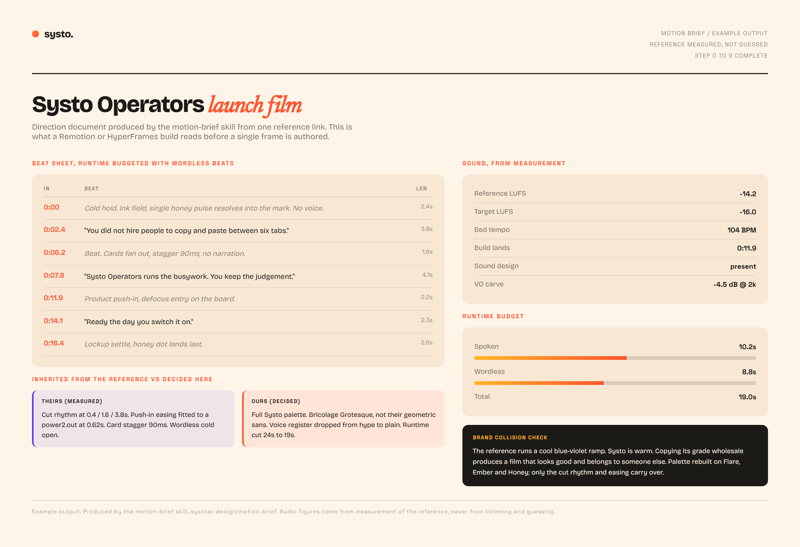

# motion-brief

**A Systo skill.** Turn a motion-graphics reference into a script and direction document
*before* anything gets built.

A reference link is not a brief. "Make me something like this" plus a YouTube URL is the
most common way a motion project starts, and the most common way it ends up rebuilt from
scratch after the first render. This skill produces the document a Remotion, HyperFrames
or After Effects build then follows.

---

## What it produces



*Example output. Rendered from `examples/example-brief.html` in this repo.*

Four things a build can actually act on:

1. **A beat sheet with real timings**, where wordless beats are budgeted as beats, not
   left as whatever time is spare after the words.
2. **A sound spec derived from measurement**, not from listening and guessing. LUFS,
   tempo, where the build lands, whether sound design exists at all.
3. **A runtime budget** split between spoken and wordless, so the pacing survives
   contact with the script.
4. **An explicit inherited-versus-decided split**, so nobody has to reverse-engineer
   later which choices came from the reference and which were made for this brand.

---

## The two failures it exists to catch

Both happen before a single frame is built, and both are invisible until the film is done.

**The reference's palette is almost never the client's palette.** Copying it wholesale
produces a film that looks great and belongs to someone else. The brand collision check
is a required step, not a review note. In the example above the reference runs a cool
blue-violet ramp against a warm brand, so only the cut rhythm and the fitted easing carry
over; the grade is rebuilt.

**Runtime gets budgeted from word count alone**, so the holds, the breaths and the
moments the reference is actually built around get squeezed out, and the pacing dies. The
example budgets 8.8 seconds of wordless time out of 19, on purpose, in writing.

---

## How it works

Ten steps, in order. The order matters: the brand loads before anything is watched, so
the reference is never the first thing to shape your taste for the project.

| Step | What happens |
|---|---|
| 0 | Load the brand before watching anything |
| 1 | Get the file (YouTube, Vimeo, Pinterest, local) |
| 2 | Watch it as contact sheets |
| 3 | **Measure** the audio. Loudness, instrumentation, arrangement. Do not guess |
| 4 | Name the register |
| 5 | The brand collision check, never skipped |
| 6 | Write the script |
| 7 | Budget runtime with wordless beats |
| 8 | Spec the sound from the measurements |
| 9 | Separate your calls from theirs |

Step 3 is the one people skip. Loudness and tempo are cheap to measure and impossible to
eyeball, and every downstream decision about where a build lands depends on them.

---

## When it fires

- Someone shares a video reference and wants "something like this"
- A script, beat sheet, storyboard, treatment or direction doc is requested for a promo,
  explainer, brand film or sizzle reel
- A film needs its runtime, pacing or sound specced
- A build is about to start from a one-line brief and a link

It does **not** build the film. That is the downstream framework's job.

---

## Install

```bash
git clone https://github.com/systoai-design/motion-brief.git ~/.claude/skills/motion-brief
```

On Windows, keep the repo off `C:` and expose it with a junction:

```powershell
git clone https://github.com/systoai-design/motion-brief.git "E:\New Claude\skills\motion-brief"
New-Item -ItemType Junction -Path "$env:USERPROFILE\.claude\skills\motion-brief" -Target "E:\New Claude\skills\motion-brief"
```

## Layout

```
SKILL.md                     the skill itself
examples/example-brief.html  the rendered example above, open it in a browser
docs/                        the screenshot
```

## Related Systo skills

- [**motion-graphics-director**](https://github.com/systoai-design/motion-graphics-director) decides how much production pipeline a piece needs, and
  runs before this one
- [**manifesto**](https://github.com/systoai-design/manifesto) is the other end of the same problem: when the ask is to match a
  reference frame for frame rather than to be inspired by it
- [**hyperframes-render-discipline**](https://github.com/systoai-design/hyperframes-render-discipline) for verifying the render this brief produces

## House style

Plain English, confident, warm. No em dashes.
