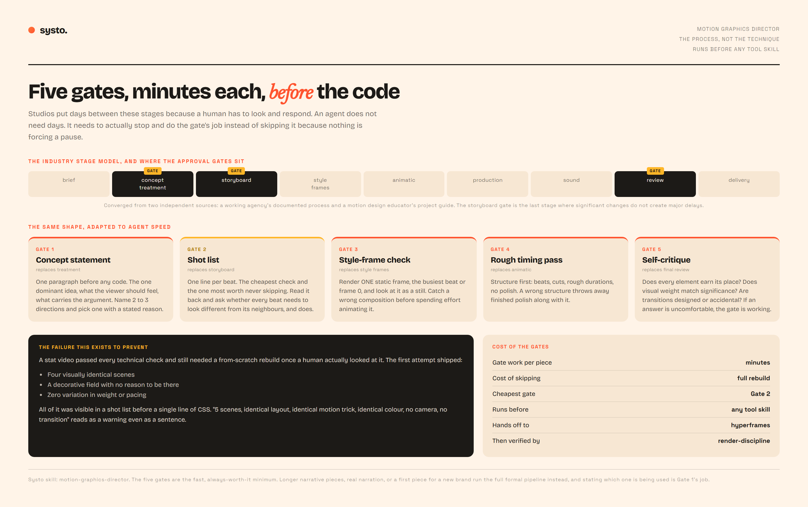

# motion-graphics-director

**A Systo skill.** The process layer for any motion graphics or video build. It runs
*before* the tool-specific skills and decides how much of the real production pipeline a
given piece actually needs.

Other skills govern technique. This one governs the order of operations, and skipping
that order is what produces a build that passes every technical check and still needs a
from-scratch rebuild once a human actually looks at it.

---

## The five gates



*Rendered from `examples/five-gates.html` in this repo.*

Studios put days between these stages because a human has to look and respond. An agent
does not need days. It needs to actually stop and do the gate's job rather than skip it
because nothing external is forcing a pause. Each gate is minutes of work, but it is real
work, done *before* the next stage rather than folded into it.

| Gate | Replaces | The job |
|---|---|---|
| 1. Concept statement | treatment | One paragraph before any code. The one dominant idea, what the viewer should feel, what carries the argument. If the brief does not obviously imply one idea, name 2 to 3 candidate directions and pick one with a stated reason. |
| 2. Shot list | storyboard | One plain-text line per beat. The cheapest possible check and the one most worth never skipping. |
| 3. Style-frame check | style frames | Render ONE static frame, the busiest beat or frame 0, and look at it as a still image rather than mid-motion. |
| 4. Rough timing pass | animatic | Build the structure first, with no polish. A wrong structure throws away finished polish along with it. |
| 5. Self-critique | final review | Ask the four questions of the whole piece before any tool-level check runs. |

## Why the shot list is the gate that matters most

The industry converges on the storyboard gate as the last stage where significant changes
do not create major delays, and Gate 2 is its cheap equivalent.

The failure that produced this skill was fully visible in a shot list before a single line
of CSS existed. A stat video shipped four visually identical scenes, a decorative field
with no reason to be there, and zero variation in weight or pacing. Written out as a
sentence, the shot list read:

> 5 scenes, identical layout, identical motion trick, identical colour, no camera, no
> transition

That reads as a warning even in plain text. Nobody had to render anything to see it.

## Gate 5, in full

Before the tool-level checks run, ask of the whole piece:

- Does every element on screen earn its place, or is something there because it was
  available rather than because this shot needs it?
- Does visual weight match actual significance, or is everything given identical treatment?
- Are transitions between beats designed, or are they accidental hard cuts?
- Is there one dominant motif, or is the piece doing several unrelated things at once?

Answer honestly against the actual build rather than against what was intended. If any
answer is uncomfortable, the gate is working.

## When to run the full pipeline instead

The five gates are the fast, always-worth-it minimum. Some pieces genuinely need a full
formal pipeline: longer narrative work (60 to 90 seconds and up), anything with real
narration requiring script-to-voiceover sync, or a first piece for a new brand with no
already-verified tokens to reuse. Use the full pipeline there and the five gates for
everything else, including fast iterative work on an established series.

Stating which one is being used, and why, is Gate 1's job.

---

## Install

```bash
git clone https://github.com/systoai-design/motion-graphics-director.git ~/.claude/skills/motion-graphics-director
```

On Windows, keep the repo off `C:` and expose it with a junction:

```powershell
git clone https://github.com/systoai-design/motion-graphics-director.git "E:\New Claude\skills\motion-graphics-director"
New-Item -ItemType Junction -Path "$env:USERPROFILE\.claude\skills\motion-graphics-director" -Target "E:\New Claude\skills\motion-graphics-director"
```

## Layout

```
SKILL.md                    the skill itself
examples/five-gates.html    the diagram above, open it in a browser
docs/                       the screenshot
```

## Where this hands off

Gates 1 and 2 produce a concept and a shot list. Then pick the tool. Gates 3 and 4 run
inside that tool's own build loop, and Gate 5 runs before the technical checks.

## Related Systo skills

- [**motion-brief**](https://github.com/systoai-design/motion-brief) turns a reference
  link into the script and direction document this process then executes
- [**manifesto**](https://github.com/systoai-design/manifesto) for when the ask is to
  match a reference frame for frame rather than to be inspired by it
- [**hyperframes-render-discipline**](https://github.com/systoai-design/hyperframes-render-discipline)
  runs after Gate 5, for the technical verification of the finished render
- [**threejs-scroll-sites**](https://github.com/systoai-design/threejs-scroll-sites) for
  scroll-driven 3D work rather than linear video
- [**swipefile**](https://github.com/systoai-design/swipefile) for websites rather than
  motion

## House style

Plain English, confident, warm. No em dashes.
